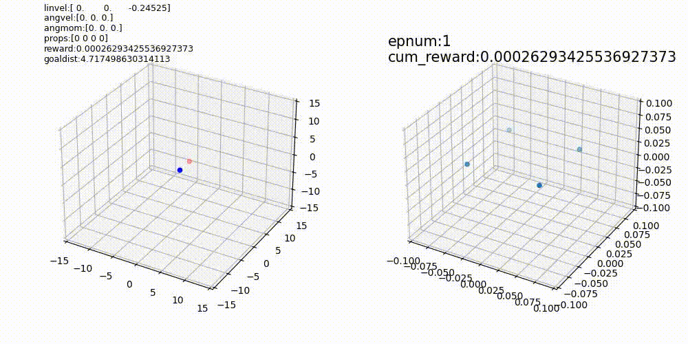

#RL Drone Agent

An attempt to train a DQN agent to fly a simulated quadcopter drone using the tensorflow agents library and custom simulated environment.

##Results

##How it works

The goal of each training episode is for the agent to pilot the drone to a randomly selected coordinate in space. At each timestep the agent is given a vector pointing to this goal coordinate, a quaternion orientation vector, velocity vector and angular momentum vector. The agent then chooses from a set of options for the thrusts of the 4 propellers. Reward is given incrementally for getting closer to the goal coordinate as well as for reaching this goal.

The simulated environment models the drone as the application of four variable forces to the upper corners of a rigidbody. The inertia_calc notebook converts an stl file into an inertia tensor, allowing the rigidbody to model a specific drone. The simulation simply uses the Euler method to update position and rotation, thus simulation timesteps are set to be much shorter than the timesteps fed into the agent.